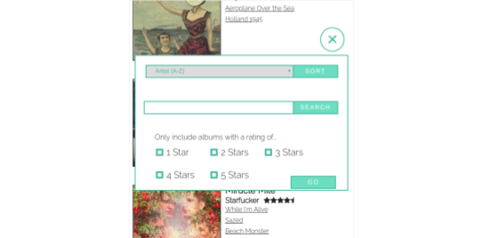

# The Music Project
## The story
Spurred to broaden my taste in music, I began listening to a new album every week. The music project is a way to keep track of the albums to which I've listened and keep track of their ratings and my favorite tracks. Content is generated dynamically to ensure scalability and DOM manipulation allows users to sort, search, and filter.

## The technology
1. Javascript
2. HTML
3. CSS

## Screenshots

